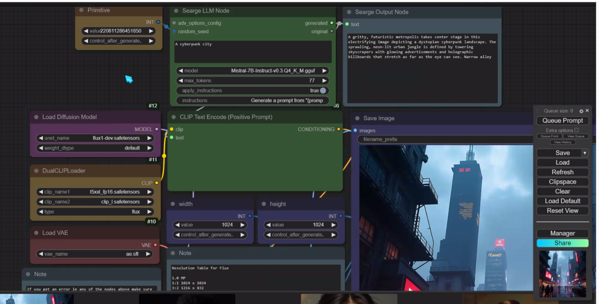

- [ComfyUI](#comfyui)
  - [Workflow](#workflow)
  - [ComfyUI-AnimateAnyone-Evolved](#comfyui-animateanyone-evolved)
  - [ComfyUI tutorial](#comfyui-tutorial)
    - [How to save a workflow in the folder workflow](#how-to-save-a-workflow-in-the-folder-workflow)
    - [Ultimate SD Upscale missing](#ultimate-sd-upscale-missing)
    - [controlnet](#controlnet)
    - [Instant ID](#instant-id)
  - [Using Searge](#using-searge)
  - [keyboard shotcut](#keyboard-shotcut)
    - [check](#check)

# ComfyUI

## Workflow

[Link comfyworkflows](https://comfyworkflows.com/)

## ComfyUI-AnimateAnyone-Evolved

[Link to github](https://github.com/ankur8613/ComfyUI-AnimateAnyone-Evolved)

## ComfyUI tutorial

[ComfyUI Workflow Creation Essentials For Beginners](https://www.youtube.com/watch?v=VM9snsuoqBc)

[Master AI image generation - ComfyUI full tutorial 2024](https://www.youtube.com/watch?v=g74Cq9Ip2ik ) 
start again at [44'](https://youtu.be/g74Cq9Ip2ik?si=Ig7ef4y0-AP27nfq&t=2644)

### How to save a workflow in the folder workflow

[Link to discord](https://discord.com/channels/1102237470457864282/1102259141839441960/1286992144460156970)

### Ultimate SD Upscale missing 

### controlnet 

Install Models / controlnet Union not found

|ID| Type|Base|Name|Filename|Description|
|----------|----------|----------|----------|----------|--------|
| 313 | controlnet|SDXL|xinsir/ControlNet++: All-in-one ControlNet|diffusion_pytorch_model.safetensors|All-in-one ControlNet for image generations and editing!|

Install Nodes

comfyUI-art-venture (preprocessor )

### Instant ID

https://github.com/cubiq/ComfyUI_InstantID

install nodes from : 
100	cubiq	 ComfyUI InstantID (Native Support)

install InsightFace Model

https://huggingface.co/InstantX/InstantID/resolve/main/ip-adapter.bin?download=true

in 

    comfyUI/models/instantid

Also install instantid model 

https://github.com/cubiq/ComfyUI_IPAdapter_plus/issues/263
same i had the double /models/antelopev2/antelopev2/ THANK YOU!

## Using Searge 

https://learn.thinkdiffusion.com/introduction-to-flux-ai-quick-guide/#download-workflow-for-the-webinar

Install nodes
https://github.com/SeargeDP/SeargeSDXL
https://github.com/SeargeDP/ComfyUI_Searge_LLM

Install Mistral
https://huggingface.co/MaziyarPanahi/Mistral-7B-Instruct-v0.3-GGUF/resolve/main/Mistral-7B-Instruct-v0.3.Q4_K_M.gguf

Create a new folder called llm_gguf in the ComfyUI/models directory.

## keyboard shotcut

| key | action | 
|-|-|
| ctrl + left mouse| select node | 
| shift + ctrl | move selected node |
 ctrl + A| select all |
|Ctrl M| Mute a Node |
 Ctrl + B | Bypass |
 double click| search|
 |ctrl+shift+V|paste with link|

convert widget to input -> search -> primitive (Reroute Primitive )

### check

Install custom nodes : Image chooser

Model : 4x-UltraSharp