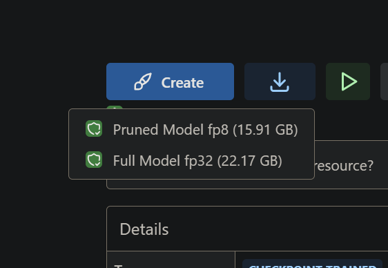
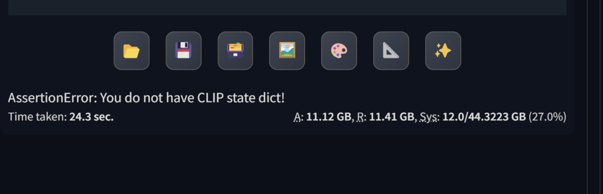
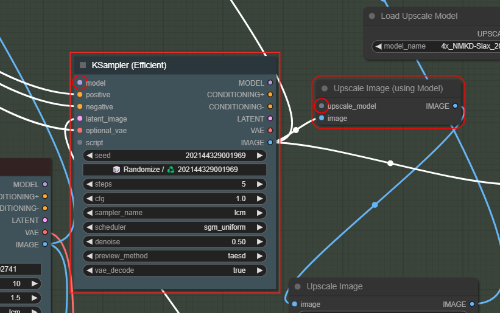

- [1. process](#1-process)
- [2. Flux](#2-flux)
- [3. Hidden Faces](#3-hidden-faces)
  - [3.1. Prompt](#31-prompt)
- [4. LORA](#4-lora)
  - [4.1. Lora for Flux](#41-lora-for-flux)
  - [4.2. Alien for flux 1.D](#42-alien-for-flux-1d)
  - [4.3. Post to make on discord](#43-post-to-make-on-discord)
- [5. Dancing Noodles](#5-dancing-noodles)
  - [5.1. Tuto 1](#51-tuto-1)
  - [5.2. Tuto 2](#52-tuto-2)
  - [5.3. Dance Video](#53-dance-video)
- [7. Youtube download](#7-youtube-download)
  - [7.1. VLC not working](#71-vlc-not-working)
  - [7.2. use firefox extension](#72-use-firefox-extension)

Create Table of Contents / update Table of contentsP

# 1. process

[Learn ThinkDiffusion](https://www.thinkdiffusion.com/learn)

[Link to Roop](https://github.com/s0md3v/sd-webui-roop)

[Mastering Image Prompts in Stable Diffusion AI with IP-Adapter](https://learn.thinkdiffusion.com/mastering-image-prompts-in-stable-diffusion-ai/)

[Make anyone say anything with Wav2Lip's Lip Sync and any existing video](https://learn.thinkdiffusion.com/wav2lip-lip-sync-any-existing-video/)

# 2. Flux

[Link to Flux Model](https://huggingface.co/lllyasviel/flux1-dev-bnb-nf4/tree/main)

Link to copy in Forge/Models/Stable Diffusion :

https://huggingface.co/lllyasviel/flux1-dev-bnb-nf4/resolve/main/flux1-dev-bnb-nf4.safetensors

https://huggingface.co/lllyasviel/flux1-dev-bnb-nf4/resolve/main/flux1-dev-bnb-nf4-v2.safetensors

Run Forge 

# 3. Hidden Faces 

[Link to tuto HiddenFaces](https://learn.thinkdiffusion.com/hidden-faces-and-text-with-control-net-qr-code-monster/)

## 3.1. Prompt

mountains, red sunset, 4k, ultra detailed, masterpiece
An autumn landscape in a mountainous forest, 4k, ultra detailed, masterpiece
In a tropical and rocky forest during autumn, 4k, ultra detailed, masterpiece

# 4. LORA

[Lora models and how to use them with Stable Diffusion](https://learn.thinkdiffusion.com/how-to-use-loras/)

## 4.1. Lora for Flux

[Emmanuel MACRON FLUX DEV LORA](https://civitai.com/models/652678/emmanuel-macron-flux-dev-lora)

https://civitai.com/api/download/models/742325?type=Model&format=SafeTensor

<lora:emmanuel macron:1>
<lora:Macron_Lora_Civitai_r1:1>

realistic photo of a Emmanuel Macron  with hair rollers on it's head,<lora:Macron_Lora_Civitai_r1:1>

Link to Flux on Civitai 
https://civitai.com/models/618692?modelVersionId=691639 

## 4.2. Alien for flux 1.D

https://civitai.com/models/213836/xenomorph-alien-flux1d-and-sdxl?modelVersionId=736892

Base model: Flux.1 D (D for dev model. S for Schnell model. I only use D for the best quality!)

## 4.3. Post to make on discord

Install Flux from civitail

AssertionError: You do not have CLIP state dict!
Time taken: 24.3 sec.

A: 11.12 GB, R: 11.41 GB, Sys: 12.0/44.3223 GB (27.0%)*

[Link to discord discussion](
https://discord.com/channels/1102237470457864282/1102259141839441960/1286089274889863199)

# 5. Dancing Noodles

## 5.1. Tuto 1
[link to the tutorial](https://learn.thinkdiffusion.com/transform-videos-with-ai-dancing-noodles-step-by-step-tutorial/)

## 5.2. Tuto 2
[tuto 2](https://www.youtube.com/watch?v=d3vpKqTiTvc)

[Link to dance-transfer Discord](https://discord.com/channels/808550927774515250/1268437080585932800/1268538941334618173)

## 5.3. Dance Video

[Link 1 for credits](https://www.youtube.com/watch?v=rY9PDSfEjUk)

<<<<<<< HEAD

# Youtube download 

## VLC not working
=======
Last log lines :

    Requested to load ControlNet
    Requested to load ControlNet
    Requested to load AnimateDiffModel
    Requested to load BaseModel
    Loading 4 new models

Missing input for model

# 7. Youtube download 

## 7.1. VLC not working
>>>>>>> bdba172e6da97ed6055cc5e7122c08a2aab8c7df
Media / Convert media / Network / URL Youtube

Patch VLV : Go to [code videolan](https://code.videolan.org/videolan/vlc/-/tree/master/share/lua/playlist)

and download this file [youtube.lua](https://code.videolan.org/videolan/vlc/-/blob/c49166f43588bd9dccb85620316ae4f5c28ae797/share/lua/playlist/youtube.lua)

In this directory : C:\Program Files\VideoLAN\VLC\lua\playlist
replace the youtube.luac file

## 7.2. use firefox extension

use [this](https://videodroid.org/pro_upgrade.html)

moz-extension://66ac18bd-3ddd-409e-b964-8e09bf093566/options/options.html

