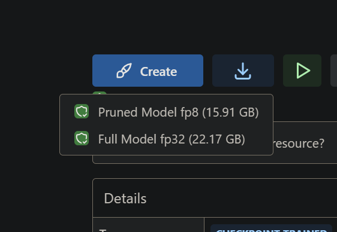
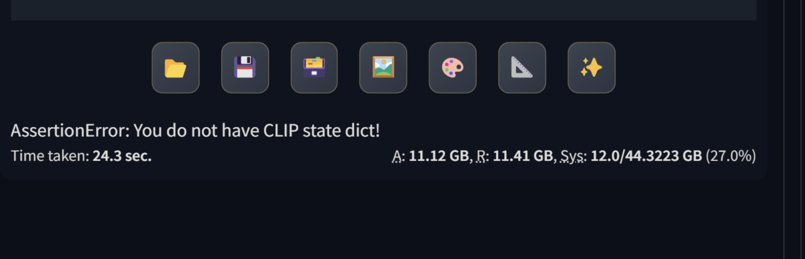
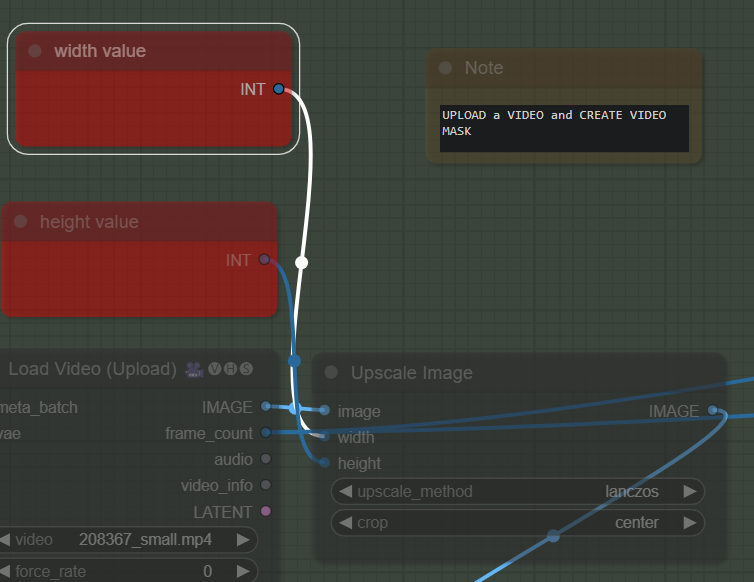
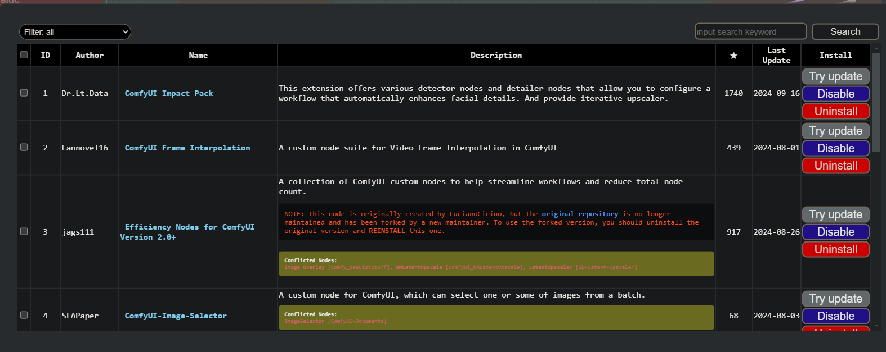

# process

[Learn ThinkDiffusion](https://www.thinkdiffusion.com/learn)

[Link to Roop](https://github.com/s0md3v/sd-webui-roop)

[Mastering Image Prompts in Stable Diffusion AI with IP-Adapter](https://learn.thinkdiffusion.com/mastering-image-prompts-in-stable-diffusion-ai/)

[Make anyone say anything with Wav2Lip's Lip Sync and any existing video](https://learn.thinkdiffusion.com/wav2lip-lip-sync-any-existing-video/)

## Flux

[Link to Flux Model](https://huggingface.co/lllyasviel/flux1-dev-bnb-nf4/tree/main)

Link to copy in Forge/Models/Stable Diffusion :

https://huggingface.co/lllyasviel/flux1-dev-bnb-nf4/resolve/main/flux1-dev-bnb-nf4.safetensors

https://huggingface.co/lllyasviel/flux1-dev-bnb-nf4/resolve/main/flux1-dev-bnb-nf4-v2.safetensors

Run Forge 

## Hidden Faces 

[Link to tuto HiddenFaces](https://learn.thinkdiffusion.com/hidden-faces-and-text-with-control-net-qr-code-monster/)

### Prompt

mountains, red sunset, 4k, ultra detailed, masterpiece
An autumn landscape in a mountainous forest, 4k, ultra detailed, masterpiece
In a tropical and rocky forest during autumn, 4k, ultra detailed, masterpiece

## LORA

[Lora models and how to use them with Stable Diffusion](https://learn.thinkdiffusion.com/how-to-use-loras/)

## Lora for Flux

[Emmanuel MACRON FLUX DEV LORA](https://civitai.com/models/652678/emmanuel-macron-flux-dev-lora)

https://civitai.com/api/download/models/742325?type=Model&format=SafeTensor

<lora:emmanuel macron:1>
<lora:Macron_Lora_Civitai_r1:1>

realistic photo of a Emmanuel Macron  with hair rollers on it's head,<lora:Macron_Lora_Civitai_r1:1>

Link to Flux on Civitai 
https://civitai.com/models/618692?modelVersionId=691639 

## Alien for flux 1.D

https://civitai.com/models/213836/xenomorph-alien-flux1d-and-sdxl?modelVersionId=736892

Base model: Flux.1 D (D for dev model. S for Schnell model. I only use D for the best quality!)

## Post to make on discord

Install Flux from civitail

AssertionError: You do not have CLIP state dict!
Time taken: 24.3 sec.

A: 11.12 GB, R: 11.41 GB, Sys: 12.0/44.3223 GB (27.0%)*

[Link to discord discussion](
https://discord.com/channels/1102237470457864282/1102259141839441960/1286089274889863199)

## Dancing Noodles

[link to the tutorial](https://learn.thinkdiffusion.com/transform-videos-with-ai-dancing-noodles-step-by-step-tutorial/)

File : dance-transfer-v80.json
Recommend : Turbo 24gb machine

ID  	Author	Name	Description	   ★   	Last Update	Install
	1	Dr.Lt.Data	 ComfyUI Impact Pack	This extension offers various detector nodes and detailer nodes that allow you to configure a workflow that automatically enhances facial details. And provide iterative upscaler.	1740	2024-09-16	
	2	Fannovel16	 ComfyUI Frame Interpolation	A custom node suite for Video Frame Interpolation in ComfyUI	439	2024-08-01	
	3	jags111	 Efficiency Nodes for ComfyUI Version 2.0+	A collection of ComfyUI custom nodes to help streamline workflows and reduce total node count.
NOTE: This node is originally created by LucianoCirino, but the original repository is no longer maintained and has been forked by a new maintainer. To use the forked version, you should uninstall the original version and REINSTALL this one.

Conflicted Nodes:
Image Overlay [Comfy_KepListStuff], NNLatentUpscale [ComfyUi_NNLatentUpscale], LatentUpscaler [SD-Latent-Upscaler]

917	2024-08-26	Install
	4	SLAPaper	 ComfyUI-Image-Selector	A custom node for ComfyUI, which can select one or some of images from a batch.
Conflicted Nodes:
ImageSelector [ComfyUI-Documents]

68	2024-08-03	Install
	5	cubiq	 ComfyUI_IPAdapter_plus	ComfyUI reference implementation for IPAdapter models. The code is mostly taken from the original IPAdapter repository and laksjdjf's implementation, all credit goes to them. I just made the extension closer to ComfyUI philosophy.	3854	2024-09-13	Install
	6	jamesWalker55	 Various ComfyUI Nodes by Type	Nodes: JWInteger, JWFloat, JWString, JWImageLoadRGB, JWImageResize, ...	48	2024-09-19	Install
	7	Kosinkadink	 AnimateDiff Evolved	A forked repository that actively maintains AnimateDiff, created by ArtVentureX.

Improved AnimateDiff integration for ComfyUI, adapts from sd-webui-animatediff.
Download one or more motion models from Original Models | Finetuned Models. See README for additional model links and usage. Put the model weights under ComfyUI/custom_nodes/ComfyUI-AnimateDiff-Evolved/models. You are free to rename the models, but keeping original names will ease use when sharing your workflow.

2610	2024-09-19	Install
	8	shadowcz007	 comfyui-mixlab-nodes	3D, ScreenShareNode & FloatingVideoNode, SpeechRecognition & SpeechSynthesis, GPT, LoadImagesFromLocal, Layers, Other Nodes, ...
Conflicted Nodes:
RandomPrompt [ComfyUI-Malefish-Custom-Scripts], RandomPrompt [ComfyUI_PRNodes], DepthViewer [ComfyUI-Depth-Visualization], TransparentImage [ComfyUI-TrollSuite], ImageBatchToList_ [comfyui-Image-reward], VAEDecodeConsistencyDecoder [comfyui-consistency-decoder], VAELoaderConsistencyDecoder [comfyui-consistency-decoder], AudioPlay [comfyui-sound-lab]

1141	2024-09-20	Install
	9	yolain	 ComfyUI Easy Use	To enhance the usability of ComfyUI, optimizations and integrations have been implemented for several commonly used nodes.	894	2024-09-18	Install
	10	viperyl	 ComfyUI-BiRefNet	Bilateral Reference Network achieves SOTA result in multi Salient Object Segmentation dataset, this repo pack BiRefNet as ComfyUI nodes, and make this SOTA model easier use for everyone.	209	2024-08-17	Install
	11	Indra's Mirror	 ComfyUI-Documents	ComfyUI-Documents is a powerful extension for ComfyUI that enhances workflows with advanced document processing capabilities. It includes nodes for loading and parsing various document types (PDF, TXT, DOC, DOCX), converting PDF pages to images, splitting PDFs into individual pages, and selecting specific images from batches. Features include text extraction, image conversion, and seamless integration with existing ComfyUI projects.
Conflicted Nodes:
ImageSelector [ComfyUI-Image-Selector]

33	2024-07-11	Install

## ComfyUI-AnimateAnyone-Evolved

[Link to github](https://github.com/ankur8613/ComfyUI-AnimateAnyone-Evolved)

## ComfyUI tutorial

[ComfyUI Workflow Creation Essentials For Beginners](https://www.youtube.com/watch?v=VM9snsuoqBc)
