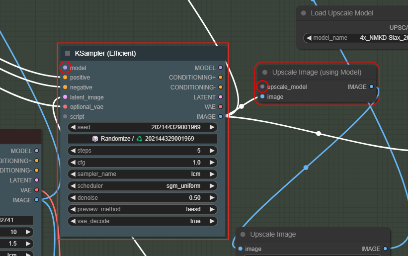
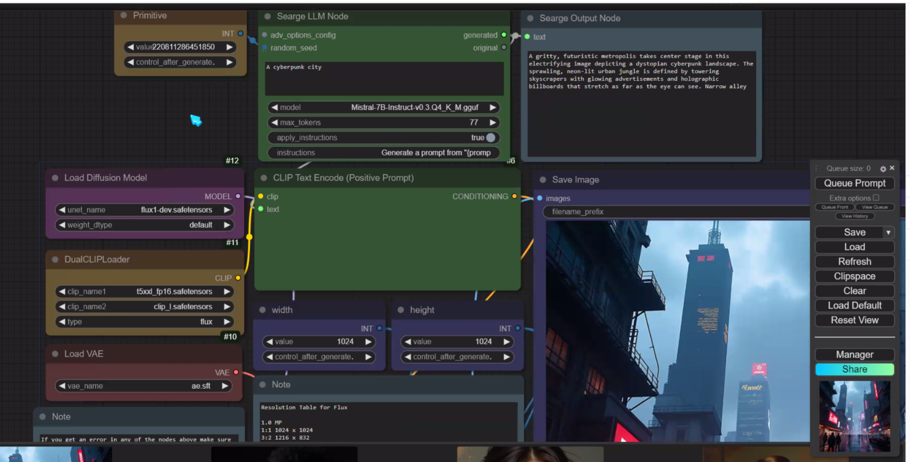

- [1. process](#1-process)
- [2. Flux](#2-flux)
- [3. Hidden Faces](#3-hidden-faces)
  - [3.1. Prompt](#31-prompt)
- [4. LORA](#4-lora)
  - [4.1. Lora for Flux](#41-lora-for-flux)
  - [4.2. Alien for flux 1.D](#42-alien-for-flux-1d)
  - [4.3. Post to make on discord](#43-post-to-make-on-discord)
- [5. Dancing Noodles](#5-dancing-noodles)
  - [5.1. Tuto 1](#51-tuto-1)
  - [5.2. Tuto 2](#52-tuto-2)
  - [5.3. Dance Video](#53-dance-video)
- [6. ComfyUI](#6-comfyui)
  - [6.0 beginners guide](#60-beginners-guide)
  - [6.1. Workflow](#61-workflow)
  - [6.2. ComfyUI-AnimateAnyone-Evolved](#62-comfyui-animateanyone-evolved)
  - [6.3. ComfyUI tutorial](#63-comfyui-tutorial)
    - [6.3.1. How to save a workflow in the folder workflow](#631-how-to-save-a-workflow-in-the-folder-workflow)
    - [6.3.2. Ultimate SD Upscale missing](#632-ultimate-sd-upscale-missing)
    - [6.3.3. controlnet](#633-controlnet)
    - [6.3.4. Instant ID](#634-instant-id)
  - [6.4. Using Searge](#64-using-searge)
  - [6.5. keyboard shotcut](#65-keyboard-shotcut)
    - [6.5.1. check](#651-check)
  - [6.6 IP adapter](#66-ip-adapter)
  - [6.7](#67)
- [7. Youtube download](#7-youtube-download)
  - [7.1. VLC not working](#71-vlc-not-working)
  - [7.2. use firefox extension](#72-use-firefox-extension)

Create Table of Contents / update Table of contentsP

# 1. process

[Learn ThinkDiffusion](https://www.thinkdiffusion.com/learn)

[Link to Roop](https://github.com/s0md3v/sd-webui-roop)

[Mastering Image Prompts in Stable Diffusion AI with IP-Adapter](https://learn.thinkdiffusion.com/mastering-image-prompts-in-stable-diffusion-ai/)

[Make anyone say anything with Wav2Lip's Lip Sync and any existing video](https://learn.thinkdiffusion.com/wav2lip-lip-sync-any-existing-video/)

# 2. Flux

[Link to Flux Model](https://huggingface.co/lllyasviel/flux1-dev-bnb-nf4/tree/main)

Link to copy in Forge/Models/Stable Diffusion :

https://huggingface.co/lllyasviel/flux1-dev-bnb-nf4/resolve/main/flux1-dev-bnb-nf4.safetensors

https://huggingface.co/lllyasviel/flux1-dev-bnb-nf4/resolve/main/flux1-dev-bnb-nf4-v2.safetensors

Run Forge 

# 3. Hidden Faces 

[Link to tuto HiddenFaces](https://learn.thinkdiffusion.com/hidden-faces-and-text-with-control-net-qr-code-monster/)

## 3.1. Prompt

mountains, red sunset, 4k, ultra detailed, masterpiece
An autumn landscape in a mountainous forest, 4k, ultra detailed, masterpiece
In a tropical and rocky forest during autumn, 4k, ultra detailed, masterpiece

# 4. LORA

[Lora models and how to use them with Stable Diffusion](https://learn.thinkdiffusion.com/how-to-use-loras/)

## 4.1. Lora for Flux

[Emmanuel MACRON FLUX DEV LORA](https://civitai.com/models/652678/emmanuel-macron-flux-dev-lora)

https://civitai.com/api/download/models/742325?type=Model&format=SafeTensor

<lora:emmanuel macron:1>
<lora:Macron_Lora_Civitai_r1:1>

realistic photo of a Emmanuel Macron  with hair rollers on it's head,<lora:Macron_Lora_Civitai_r1:1>

Link to Flux on Civitai 
https://civitai.com/models/618692?modelVersionId=691639 

## 4.2. Alien for flux 1.D

https://civitai.com/models/213836/xenomorph-alien-flux1d-and-sdxl?modelVersionId=736892

Base model: Flux.1 D (D for dev model. S for Schnell model. I only use D for the best quality!)

## 4.3. Post to make on discord

Install Flux from civitail

AssertionError: You do not have CLIP state dict!
Time taken: 24.3 sec.

A: 11.12 GB, R: 11.41 GB, Sys: 12.0/44.3223 GB (27.0%)*

[Link to discord discussion](
https://discord.com/channels/1102237470457864282/1102259141839441960/1286089274889863199)

# 5. Dancing Noodles

## 5.1. Tuto 1
[link to the tutorial](https://learn.thinkdiffusion.com/transform-videos-with-ai-dancing-noodles-step-by-step-tutorial/)

## 5.2. Tuto 2
[tuto 2](https://www.youtube.com/watch?v=d3vpKqTiTvc)

[Link to dance-transfer Discord](https://discord.com/channels/808550927774515250/1268437080585932800/1268538941334618173)

## 5.3. Dance Video

[Link 1 for credits](https://www.youtube.com/watch?v=rY9PDSfEjUk)

Last log lines :

    Requested to load ControlNet
    Requested to load ControlNet
    Requested to load AnimateDiffModel
    Requested to load BaseModel
    Loading 4 new models

Missing input for model

# 6. ComfyUI

## 6.0 beginners guide

[link](https://www.runcomfy.com/tutorials/comfyui-beginners-guide)

Understand Model, Clip & VAE

VAE: VAE (Variational AutoEncoder) is responsible for converting the image between the pixel space and the latent space. It consists of an encoder that compresses the image into a lower-dimensional latent representation and a decoder that reconstructs the image from the latent representation. In the text-to-image process, the VAE is used only in the final step to convert the generated image from the latent space back to the pixel space. The VAE Decode node in ComfyUI takes the output of the KSampler node (which operates in the latent space) and uses the decoder part of the VAE to transform the latent representation into the final image in the pixel space.
It's important to note that the VAE is a separate component from the CLIP language model. While CLIP focuses on processing text prompts, the VAE deals with the conversion between pixel and latent spaces.

[ComfyUI: Advanced Understanding (Part 1)](https://www.youtube.com/watch?v=_C7kR2TFIX0)

[ComfyUI: Advanced understanding Part 2](https://www.youtube.com/watch?v=ijqXnW_9gzc)

## 6.1. Workflow

[Link comfyworkflows](https://comfyworkflows.com/)

## 6.2. ComfyUI-AnimateAnyone-Evolved

[Link to github](https://github.com/ankur8613/ComfyUI-AnimateAnyone-Evolved)

## 6.3. ComfyUI tutorial

[ComfyUI Workflow Creation Essentials For Beginners](https://www.youtube.com/watch?v=VM9snsuoqBc)

[Master AI image generation - ComfyUI full tutorial 2024](https://www.youtube.com/watch?v=g74Cq9Ip2ik ) 
start again at [44'](https://youtu.be/g74Cq9Ip2ik?si=Ig7ef4y0-AP27nfq&t=2644)

### 6.3.1. How to save a workflow in the folder workflow

[Link to discord](https://discord.com/channels/1102237470457864282/1102259141839441960/1286992144460156970)

### 6.3.2. Ultimate SD Upscale missing 

### 6.3.3. controlnet 

Install Models / controlnet Union not found

|ID| Type|Base|Name|Filename|Description|
|----------|----------|----------|----------|----------|--------|
| 313 | controlnet|SDXL|xinsir/ControlNet++: All-in-one ControlNet|diffusion_pytorch_model.safetensors|All-in-one ControlNet for image generations and editing!|

Install Nodes

comfyUI-art-venture (preprocessor )

### 6.3.4. Instant ID

https://github.com/cubiq/ComfyUI_InstantID

install nodes from : 
100	cubiq	 ComfyUI InstantID (Native Support)

install InsightFace Model

https://huggingface.co/InstantX/InstantID/resolve/main/ip-adapter.bin?download=true

in 

    comfyUI/models/instantid

Also install instantid model 

https://github.com/cubiq/ComfyUI_IPAdapter_plus/issues/263
same i had the double /models/antelopev2/antelopev2/ THANK YOU!

## 6.4. Using Searge 

https://learn.thinkdiffusion.com/introduction-to-flux-ai-quick-guide/#download-workflow-for-the-webinar

Install nodes
https://github.com/SeargeDP/SeargeSDXL
https://github.com/SeargeDP/ComfyUI_Searge_LLM

Install Mistral
https://huggingface.co/MaziyarPanahi/Mistral-7B-Instruct-v0.3-GGUF/resolve/main/Mistral-7B-Instruct-v0.3.Q4_K_M.gguf

Create a new folder called llm_gguf in the ComfyUI/models directory.

## 6.5. keyboard shotcut

| key | action | 
|-|-|
| ctrl + left mouse| select node | 
| shift + ctrl | move selected node |
 ctrl + A| select all |
|Ctrl M| Mute a Node |
 Ctrl + B | Bypass |
 double click| search|
 |ctrl+shift+V|paste with link|

convert widget to input -> search -> primitive (Reroute Primitive )

### 6.5.1. check

Install custom nodes : Image chooser

Model : 4x-UltraSharp

## 6.6 IP adapter

[link to github](https://github.com/tencent-ailab/IP-Adapter/)

## 6.7

[Dance Transfert from Civitail](https://civitai.com/models/559596?modelVersionId=713139)

# 7. Youtube download 

## 7.1. VLC not working
Media / Convert media / Network / URL Youtube

Patch VLV : Go to [code videolan](https://code.videolan.org/videolan/vlc/-/tree/master/share/lua/playlist)

and download this file [youtube.lua](https://code.videolan.org/videolan/vlc/-/blob/c49166f43588bd9dccb85620316ae4f5c28ae797/share/lua/playlist/youtube.lua)

In this directory : C:\Program Files\VideoLAN\VLC\lua\playlist
replace the youtube.luac file

## 7.2. use firefox extension

use [this](https://videodroid.org/pro_upgrade.html)

moz-extension://66ac18bd-3ddd-409e-b964-8e09bf093566/options/options.html

