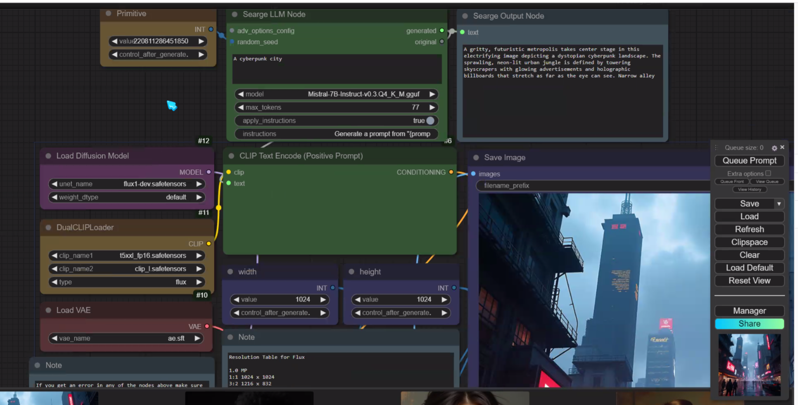

- [6. ComfyUI](#6-comfyui)
  - [6.0 beginners guide](#60-beginners-guide)
  - [6.1. Workflow](#61-workflow)
  - [6.2. ComfyUI-AnimateAnyone-Evolved](#62-comfyui-animateanyone-evolved)
  - [6.3. ComfyUI tutorial](#63-comfyui-tutorial)
    - [6.3.1. How to save a workflow in the folder workflow](#631-how-to-save-a-workflow-in-the-folder-workflow)
    - [6.3.2. Ultimate SD Upscale missing](#632-ultimate-sd-upscale-missing)
    - [6.3.3. controlnet](#633-controlnet)
    - [6.3.4. Instant ID](#634-instant-id)
  - [6.4. Using Searge](#64-using-searge)
  - [6.5. keyboard shotcut](#65-keyboard-shotcut)
    - [6.5.1. check](#651-check)
  - [6.6 IP adapter](#66-ip-adapter)
  - [6.7 Danse Transfert from civitai](#67-danse-transfert-from-civitai)

# 6. ComfyUI

## 6.0 beginners guide

[link](https://www.runcomfy.com/tutorials/comfyui-beginners-guide)

Understand Model, Clip & VAE

VAE: VAE (Variational AutoEncoder) is responsible for converting the image between the pixel space and the latent space. It consists of an encoder that compresses the image into a lower-dimensional latent representation and a decoder that reconstructs the image from the latent representation. In the text-to-image process, the VAE is used only in the final step to convert the generated image from the latent space back to the pixel space. The VAE Decode node in ComfyUI takes the output of the KSampler node (which operates in the latent space) and uses the decoder part of the VAE to transform the latent representation into the final image in the pixel space.
It's important to note that the VAE is a separate component from the CLIP language model. While CLIP focuses on processing text prompts, the VAE deals with the conversion between pixel and latent spaces.

[ComfyUI: Advanced Understanding (Part 1)](https://www.youtube.com/watch?v=_C7kR2TFIX0)

[ComfyUI: Advanced understanding Part 2](https://www.youtube.com/watch?v=ijqXnW_9gzc)

## 6.1. Workflow

[Link comfyworkflows](https://comfyworkflows.com/)

## 6.2. ComfyUI-AnimateAnyone-Evolved

[Link to github](https://github.com/ankur8613/ComfyUI-AnimateAnyone-Evolved)

## 6.3. ComfyUI tutorial

[ComfyUI Workflow Creation Essentials For Beginners](https://www.youtube.com/watch?v=VM9snsuoqBc)

[Master AI image generation - ComfyUI full tutorial 2024](https://www.youtube.com/watch?v=g74Cq9Ip2ik ) 
start again at [44'](https://youtu.be/g74Cq9Ip2ik?si=Ig7ef4y0-AP27nfq&t=2644)

### 6.3.1. How to save a workflow in the folder workflow

[Link to discord](https://discord.com/channels/1102237470457864282/1102259141839441960/1286992144460156970)

### 6.3.2. Ultimate SD Upscale missing 

### 6.3.3. controlnet 

Install Models / controlnet Union not found

|ID| Type|Base|Name|Filename|Description|
|----------|----------|----------|----------|----------|--------|
| 313 | controlnet|SDXL|xinsir/ControlNet++: All-in-one ControlNet|diffusion_pytorch_model.safetensors|All-in-one ControlNet for image generations and editing!|

Install Nodes

comfyUI-art-venture (preprocessor )

### 6.3.4. Instant ID

https://github.com/cubiq/ComfyUI_InstantID

install nodes from : 
100	cubiq	 ComfyUI InstantID (Native Support)

install InsightFace Model

https://huggingface.co/InstantX/InstantID/resolve/main/ip-adapter.bin?download=true

in 

    comfyUI/models/instantid

Also install instantid model 

https://github.com/cubiq/ComfyUI_IPAdapter_plus/issues/263
same i had the double /models/antelopev2/antelopev2/ THANK YOU!

## 6.4. Using Searge 

https://learn.thinkdiffusion.com/introduction-to-flux-ai-quick-guide/#download-workflow-for-the-webinar

Install nodes
https://github.com/SeargeDP/SeargeSDXL
https://github.com/SeargeDP/ComfyUI_Searge_LLM

Install Mistral
https://huggingface.co/MaziyarPanahi/Mistral-7B-Instruct-v0.3-GGUF/resolve/main/Mistral-7B-Instruct-v0.3.Q4_K_M.gguf

Create a new folder called llm_gguf in the ComfyUI/models directory.

## 6.5. keyboard shotcut

| key | action | 
|-|-|
| ctrl + left mouse| select node | 
| shift + ctrl | move selected node |
 ctrl + A| select all |
|Ctrl M| Mute a Node |
 Ctrl + B | Bypass |
 double click| search|
 |ctrl+shift+V|paste with link|

convert widget to input -> search -> primitive (Reroute Primitive )

### 6.5.1. check

Install custom nodes : Image chooser

Model : 4x-UltraSharp

## 6.6 IP adapter

[link to github](https://github.com/tencent-ailab/IP-Adapter/)

## 6.7 Danse Transfert from civitai

[Dance Transfert from Civitail](https://civitai.com/models/559596?modelVersionId=713139)